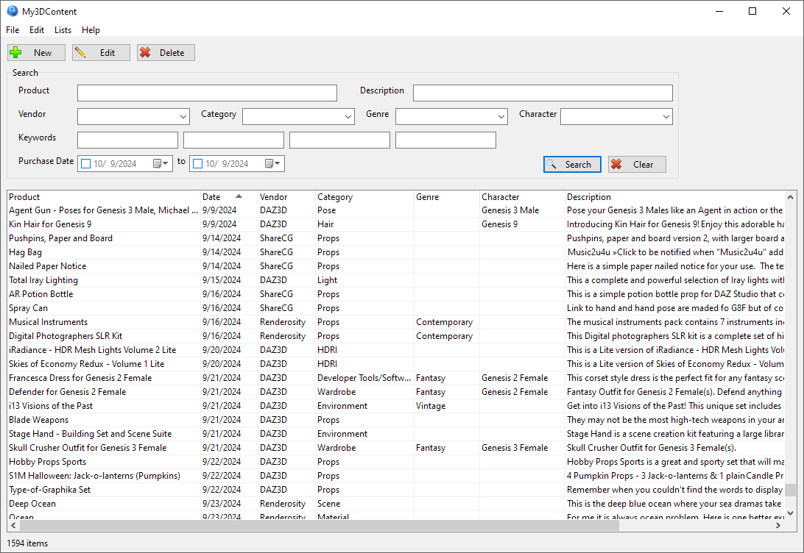

# daz-content
Little DAZ Content Manager for Mac OS

This morning I stumbled upon a little [DAZ Content Manager for Windows](https://www.renderosity.com/freestuff/items/97996/my3dcontent) made by [KeithTX](https://www.renderosity.com/users/KeithTX) and available for free at [Renderosity](https://www.renderosity.com/).

That looked awesome but I wanted to make a version that I could use on my Mac. So I decided to make my own version. I wanted to make it as simple as possible, so I decided to use Python and Tkinter. 

## Features
WIP:
- Browse and search for DAZ 3D content

Future:
- Extract metadata from DAZ 3D files
- Export metadata to CSV

## Usage
1. Download the latest release from the [releases page](https://github.com/marcobarbosa/daz-content/releases).
2. Extract the ZIP file or clone the repository.
3. Upddate the path in `tk2.py` to point to your DAZ 3D content folder.
4. Run `python3 tk2.py`    
5. Browse for DAZ 3D content.

## License
GPL3 License

Copyright (c) 2024 Marc Augier
